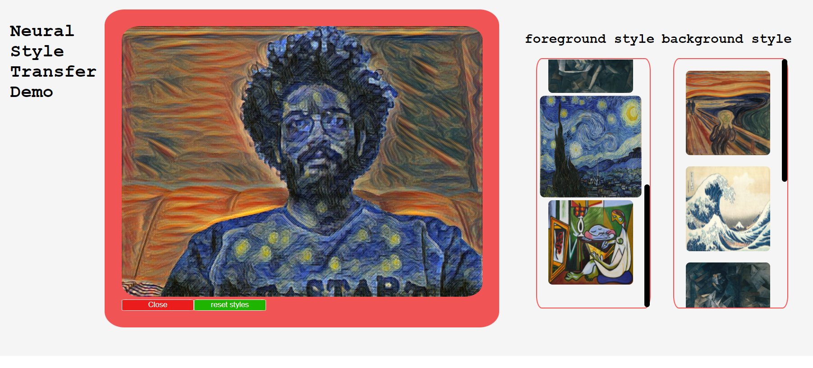

# NEURAL CAM

A fun proejct I made a while ago and decided to push recently, Neural cam is a cam app that can run two neural style transfer models on both the
"forground" and "background" of a live video cam (if you use GPU, CPU is too slow to be consdiered real-time).

**main.py**: file responsible for running the local backend server, loads the model (which is NOT included in the repo) and opens the cam.

**model.py**: file responsible for the model definition.

**Neural Style Transfer.ipynb**: Notebook for training a neural style transfer model from scratch, the training loop is heavily inspired from https://github.com/eriklindernoren/Fast-Neural-Style-Transfer/blob/master/train.py.

**neural_cam**: folder contains the frontend of the app (made with react).

and that's it.

